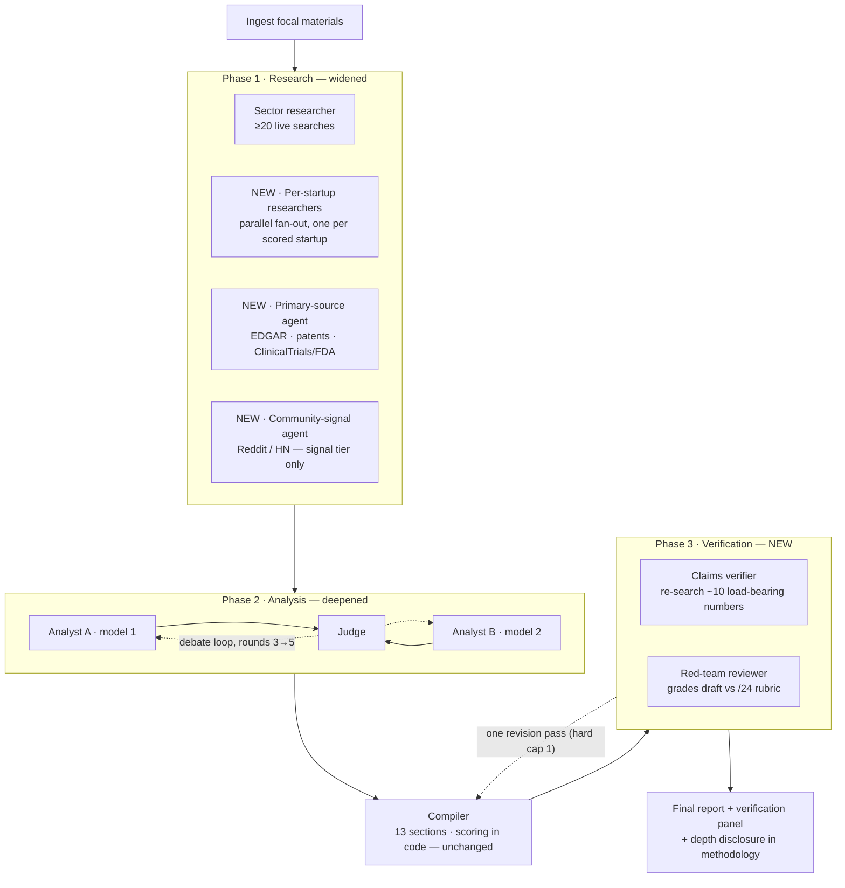

# Deep Dive Mode — Design Plan (design only, not yet built)

> Product decision (2026-07-23): two tiers only — **Memo** (today's pipeline, unchanged) and
> **Deep Dive** (this spec). No cheap/quick tier: every shipped output stays institutional-grade.
> An internal dev knob for cheap test runs is fine; it is never a customer-facing mode.

## Principles

1. **Same skeleton, deeper evidence.** The 13-section framework, R-series coherence guarantees,
   and structured artifacts are identical in both modes. Deep Dive changes how much evidence and
   scrutiny feeds the skeleton — never the shape of the output.
2. **New agents attach at seams** (research phase, post-compile verification) — the
   researcher → analysts → judge → compiler core is not rewired.
3. **Everything lands as a validated artifact.** New agent outputs get in-code validators and
   token-free tests, like every existing artifact.
4. **Depth is disclosed.** The methodology section states the mode, agent count, search count,
   debate rounds, and verification stats. Precision must never exceed disclosure — and depth
   claims must never exceed what actually ran.

## Pipeline at a glance

## Pipeline changes (by phase)

### Phase 1 — Research, widened (biggest quality lever)
- **Sector researcher**: unchanged (today's ≥20-call protocol).
- **NEW · Per-startup deep researchers (fan-out).** After the field is identified, spawn one
  focused research agent per scored startup (top ~5 + focal): 5–8 searches each on founder
  history, shipped-product evidence, customer signal, fresh news. Runs in parallel (LangGraph
  fan-out, same pattern as the analyst pair). Output: per-startup evidence briefs appended to
  `research_data`. Rationale: today ~30 calls cover a whole sector; profiles (§8/§9) are the
  thinnest sections on the rubric.
- **NEW · Primary-source agent.** Web-reachable registries first (no paid licenses required):
  SEC EDGAR, USPTO/Google Patents, ClinicalTrials.gov / FDA databases (biomed pack), official
  regulator sites. Sources tagged a new top tier: `registry` (above `official/wire`).
- **NEW · Community-signal agent** (the "stealth-searcher"). Reddit / HN / niche-forum sweep per
  startup + sector: practitioner sentiment, hiring signals, unannounced-competitor chatter.
  Tier-tagged `unverified` — signal for §1/§4/§8 color, never a basis for ledger figures.

### Phase 2 — Analysis, deepened
- Analysts A/B unchanged (identical prompt, different models) — they simply receive the richer pack.
- `MAX_DEBATE_ITERATIONS`: 3 → **5** in Deep Dive (config-driven already).
- Consciously **not** adding a third analyst: the judge/consensus logic is built for a pair;
  diversity is added at research and verification instead.

### Phase 3 — NEW · Post-compile verification
- **Claims verifier.** Extract the compiled memo's ~10 most load-bearing quantitative claims
  (valuations, rounds, ARR, dates) → re-search each with grounded search → status per claim:
  `verified / stale / contradicted / unverifiable` → `final_report.verification` artifact +
  UI panel. Reuses the call-claims-audit machinery pattern (extract → audit → join in code).
- **Red-team reviewer.** One agent grades the draft against `docs/QUALITY_RUBRIC.md` (/24) and
  returns the 3 highest-leverage defects; the compiler gets **one** revision pass with that
  critique (hard cap: 1 loop). This productizes the manual eval loop; the rubric score is
  recorded in `final_report.rubric_review` (internal by default).

### Phase 4 — Compile & disclose
- Compiler unchanged apart from the single revision pass.
- Methodology section discloses: mode, per-phase agent counts, total searches, debate rounds,
  verification pass/fail counts.

## Plumbing

- `analysis_depth: "memo" | "deep"` on `ResearchRequest` → `ResearchState` → conditional graph
  edges (compile two graph variants or gate nodes on state; prefer gating — one graph, no drift).
- Search-protocol scaling is prompt text (`TOOL_CHOREOGRAPHY_INSTRUCTIONS`) + new tool functions
  in `tools.py`; per-startup fan-out mirrors the `analysts_fanout` pattern in `pipeline.py`.
- **Budget estimates** (to validate in testing): Memo ≈ 35–50 Tavily credits, ~30 min, ~$3–4
  compute. Deep Dive ≈ 90–120 credits, ~60–90 min wall (fan-out parallelism helps), ~$8–15.
- **Gates before shipping:** paid Tavily plan (free tier ≈ 9 deep runs/mo — not viable);
  Celery limits re-check (90 min ≈ the current 5400s soft limit — raise for deep runs or
  parallelize harder); rate-limit contention testing with the fan-out.

## UI

- Mode selector on the form: **Memo** · **Deep Dive** (visible pre-launch, marked unavailable —
  the "dial" physically exists in the product).
- Progress stepper gains the new phases (per-startup research, verification, red-team).
- Report masthead badge: mode; Methodology carries the full disclosure.

## Build order (each milestone independently shippable)

1. `analysis_depth` plumbing + config knobs (rounds, protocol scaling) — small.
2. Per-startup research fan-out — medium; biggest rubric lift expected (§8/§9, freshness).
3. Claims verifier — medium; reuses call-claims pattern.
4. Red-team reviewer + single revision loop — medium.
5. Primary-source + community-signal tools — small-medium each; tool additions.
6. UI (selector, stepper phases, badge, methodology) — small, alongside 1.

## Acceptance test

Same prompt run in both modes, graded against `docs/QUALITY_RUBRIC.md`:
baseline Memo runs grade ~16–18/24. **Deep Dive ships when it repeatably grades ≥20/24**
and the verification pass confirms ≥80% of load-bearing claims. "The testing to prove each
notch" is the pitch promise — this is the notch's test.
